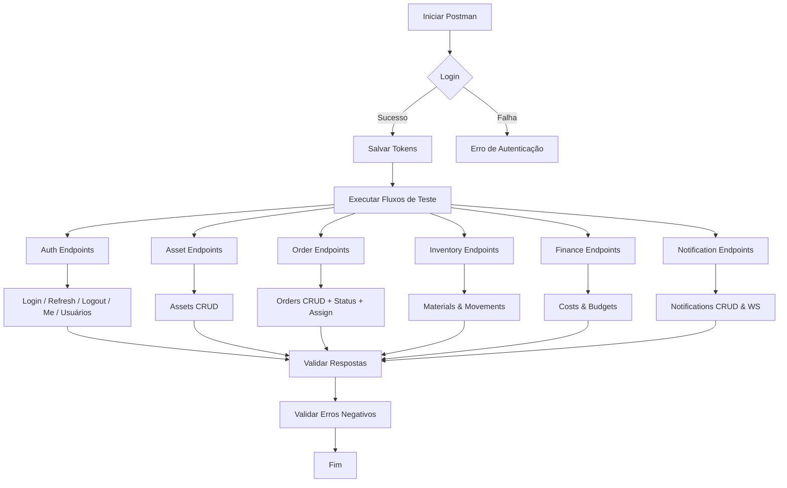

# MANUTECH — Manual Completo de Testes via Postman

> **Sistema:** MANUTECH — Gestão de Ordens de Serviço  
> **Versão da API:** 2.0.0  
> **Última atualização:** 2026-06-01  
> **Ferramenta recomendada:** Postman (também funciona com Insomnia ou qualquer cliente HTTP)

---

## ÍNDICE

1. [Configuração Inicial do Postman](#1-configuração-inicial-do-postman)
2. [Como Funciona a Autenticação](#2-como-funciona-a-autenticação)
3. [Entendendo as Respostas da API](#3-entendendo-as-respostas-da-api)
4. [SERVIÇO: Auth — Autenticação e Usuários](#4-serviço-auth--autenticação-e-usuários)
5. [SERVIÇO: Asset — Equipamentos](#5-serviço-asset--equipamentos)
6. [SERVIÇO: Order — Ordens de Serviço](#6-serviço-order--ordens-de-serviço)
7. [SERVIÇO: Inventory — Materiais e Estoque](#7-serviço-inventory--materiais-e-estoque)
8. [SERVIÇO: Finance — Custos e Orçamentos](#8-serviço-finance--custos-e-orçamentos)
9. [SERVIÇO: Notification — Notificações](#9-serviço-notification--notificações)
10. [Fluxos Completos de Teste (Cenários End-to-End)](#10-fluxos-completos-de-teste-cenários-end-to-end)
11. [Testando Erros e Casos Negativos](#11-testando-erros-e-casos-negativos)
12. [Tabela de Permissões por Role](#12-tabela-de-permissões-por-role)
13. [Glossário](#13-glossário)

---

## 1. Configuração Inicial do Postman

### 1.1 Instalação

Baixe o Postman em [postman.com/downloads](https://www.postman.com/downloads/) e instale normalmente.

### 1.2 Criando o Environment (Ambiente de Variáveis)

Um *Environment* guarda variáveis reutilizáveis como a URL base e o token JWT. Isso evita copiar e colar tokens em cada requisição.

**Passo a passo:**

1. No Postman, clique em **Environments** (ícone de olho no canto superior direito, ou menu lateral).
2. Clique em **Add** (ou **Create Environment**).
3. Dê o nome: `MANUTECH - Local`.
4. Adicione as seguintes variáveis:

| Variable | Type | Initial Value | Current Value |
|----------|------|--------------|---------------|
| `base_url` | default | `http://localhost` | `http://localhost` |
| `access_token` | secret | *(deixe vazio)* | *(deixe vazio)* |
| `refresh_token` | secret | *(deixe vazio)* | *(deixe vazio)* |

5. Clique em **Save**.
6. Selecione o environment `MANUTECH - Local` no seletor do canto superior direito.

> **Dica:** Após fazer login (seção 4.1), o `access_token` será preenchido automaticamente se você configurar o script de teste descrito lá.

### 1.3 Endereços dos Serviços

Cada serviço roda em uma porta diferente. Use as variáveis assim:

| Serviço | URL base completa |
|---------|------------------|
| Auth | `{{base_url}}:8001/api/v1` |
| Asset | `{{base_url}}:8002/api/v1` |
| Order | `{{base_url}}:8003/api/v1` |
| Inventory | `{{base_url}}:8004/api/v1` |
| Finance | `{{base_url}}:8005/api/v1` |
| Notification | `{{base_url}}:8006/api/v1` |

### 1.4 Headers Padrão para Rotas Autenticadas

Para toda requisição que **não seja** login ou refresh, configure estes headers:

| Key | Value |
|-----|-------|
| `Authorization` | `Bearer {{access_token}}` |
| `Content-Type` | `application/json` |
| `Accept` | `application/json` |

> **Como aplicar em todas as requisições de uma Collection:**  
> Crie uma Collection chamada `MANUTECH`, clique nos três pontinhos → **Edit** → aba **Authorization** → selecione `Bearer Token` e coloque `{{access_token}}`. Assim todas as requisições dentro da Collection herdam o token automaticamente.

---

## 2. Como Funciona a Autenticação

A API usa **JWT (JSON Web Token)** com dois tipos de token:

- **Access Token:** válido por **1 hora**. Enviado no header `Authorization: Bearer <token>` em toda requisição autenticada.
- **Refresh Token:** válido por **7 dias**. Usado para gerar um novo access token sem precisar logar novamente.

**Fluxo típico:**
```
1. POST /auth/login → recebe access_token + refresh_token
2. Usa access_token nas requisições por até 1 hora
3. Quando o access_token expira → POST /auth/refresh com o refresh_token
4. Recebe novo access_token
5. Quando terminar → POST /auth/logout para invalidar o refresh_token
```

### Roles (Perfis de Acesso)

| Role | Quem é |
|------|--------|
| `admin` | Administrador — acesso total |
| `supervisor` | Gerencia OS, custos, materiais |
| `technician` | Executa OS atribuídas a ele |
| `attendant` | Apenas abre novas OS |

---

## 3. Entendendo as Respostas da API

### Resposta de sucesso com lista (paginação)

Toda rota de listagem retorna este formato:

```json
{
  "items": [...],
  "total": 120,
  "page": 1,
  "page_size": 20,
  "pages": 6
}
```

- `items`: array com os resultados da página atual.
- `total`: total de registros no banco (não só da página).
- `page`: página atual.
- `page_size`: itens por página (máximo 100).
- `pages`: total de páginas.

### Resposta de erro (sempre este formato)

```json
{
  "detail": "Mensagem explicando o erro",
  "code": "CODIGO_DO_ERRO",
  "field": "nome_do_campo"
}
```

O campo `field` só aparece quando o erro é em um campo específico (validação).

### Tabela de Códigos HTTP

| Código | O que significa |
|--------|----------------|
| `200` | Sucesso — leitura ou atualização |
| `201` | Recurso criado com sucesso |
| `204` | Exclusão bem-sucedida (sem corpo na resposta) |
| `400` | Erro de negócio (ex: transição de status inválida) |
| `401` | Token ausente, expirado ou inválido |
| `403` | Você não tem permissão para esta ação (role errado) |
| `404` | Recurso não encontrado |
| `409` | Conflito — ex: e-mail ou SKU já cadastrado |
| `413` | Arquivo muito grande (acima de 20 MB) |
| `422` | Dados inválidos no body da requisição |
| `429` | Muitas tentativas de login — aguarde 15 minutos |
| `500` | Erro interno do servidor |

---

## 4. SERVIÇO: Auth — Autenticação e Usuários

**Base URL:** `{{base_url}}:8001/api/v1`

---

### 4.1 Login

**Rota:** `POST /auth/login`  
**Autenticação:** Nenhuma (rota pública)

**Body (JSON):**
```json
{
  "login": "admin@manutech.com",
  "password": "senha123"
}
```

**O que testar:**

| # | Cenário | Body | Resultado esperado |
|---|---------|------|--------------------|
| 1 | Login com admin válido | `"login": "admin@manutech.com"` | `200` com `access_token` e `refresh_token` |
| 2 | Login com supervisor | `"login": "supervisor@manutech.com"` | `200` com tokens |
| 3 | Login com técnico | `"login": "tecnico@manutech.com"` | `200` com tokens |
| 4 | Senha incorreta | `"password": "errada"` | `401` com `code: INVALID_CREDENTIALS` |
| 5 | Login inexistente | `"login": "naoexiste@x.com"` | `401` com `code: INVALID_CREDENTIALS` |
| 6 | Usuário inativo | Login de um usuário inativado | `403` com `code: USER_INACTIVE` |
| 7 | Body vazio | `{}` | `422` com `code: VALIDATION_ERROR` |

**Script de Teste automático (cole na aba "Tests" do Postman):**
```javascript
// Salva os tokens automaticamente no Environment após login bem-sucedido
if (pm.response.code === 200) {
    const body = pm.response.json();
    pm.environment.set("access_token", body.access_token);
    pm.environment.set("refresh_token", body.refresh_token);
    console.log("Tokens salvos no Environment!");
}
```

**Exemplo de resposta 200:**
```json
{
  "access_token": "eyJhbGciOiJSUzI1NiJ9...",
  "refresh_token": "eyJhbGciOiJSUzI1NiJ9...",
  "token_type": "Bearer",
  "expires_in": 3600,
  "user": {
    "id": 1,
    "name": "Admin Principal",
    "login": "admin@manutech.com",
    "role": "admin",
    "status": "active"
  }
}
```

> **Nota sobre Rate Limit:** Após 5 tentativas de login com senha errada no mesmo IP, a API bloqueia por 15 minutos e retorna `429 Too Many Requests`.

---

### 4.2 Renovar Token (Refresh)

**Rota:** `POST /auth/refresh`  
**Autenticação:** Nenhuma (rota pública)

**Body (JSON):**
```json
{
  "refresh_token": "{{refresh_token}}"
}
```

**O que testar:**

| # | Cenário | Resultado esperado |
|---|---------|-------------------|
| 1 | Refresh token válido | `200` com novo `access_token` |
| 2 | Refresh token inválido/modificado | `401` com `code: REFRESH_TOKEN_INVALID` |
| 3 | Refresh token expirado | `401` com `code: REFRESH_TOKEN_EXPIRED` |
| 4 | Refresh token após logout | `401` com `code: REFRESH_TOKEN_INVALID` |

**Exemplo de resposta 200:**
```json
{
  "access_token": "eyJhbGciOiJSUzI1NiJ9...",
  "token_type": "Bearer",
  "expires_in": 3600
}
```

---

### 4.3 Logout

**Rota:** `POST /auth/logout`  
**Autenticação:** `Bearer {{access_token}}`

**Body (JSON):**
```json
{
  "refresh_token": "{{refresh_token}}"
}
```

**O que testar:**

| # | Cenário | Resultado esperado |
|---|---------|-------------------|
| 1 | Logout com token válido | `204` sem corpo |
| 2 | Tentar usar o refresh_token após logout | `401` — token revogado |

---

### 4.4 Meus Dados (Me)

**Rota:** `GET /auth/me`  
**Autenticação:** `Bearer {{access_token}}`  
**Qualquer role pode acessar**

**O que testar:**

| # | Cenário | Resultado esperado |
|---|---------|-------------------|
| 1 | Token válido de qualquer role | `200` com dados do usuário |
| 2 | Sem token | `401` |
| 3 | Token expirado | `401` |

**Exemplo de resposta 200:**
```json
{
  "id": 1,
  "name": "João Silva",
  "login": "joao.silva",
  "email": "joao@manutech.com",
  "role": "supervisor",
  "status": "active",
  "created_at": "2025-01-15T10:00:00Z"
}
```

---

### 4.5 Listar Usuários

**Rota:** `GET /users`  
**Autenticação:** `Bearer {{access_token}}`  
**Roles permitidos:** somente `admin`

**Query Params opcionais (adicione na aba "Params" do Postman):**

| Param | Exemplo | O que faz |
|-------|---------|-----------|
| `name` | `Carlos` | Filtra por nome (busca parcial) |
| `role` | `technician` | Filtra por role |
| `status` | `active` | Filtra por status (`active` ou `inactive`) |
| `page` | `1` | Número da página |
| `page_size` | `10` | Itens por página |

**O que testar:**

| # | Cenário | Token usado | Resultado esperado |
|---|---------|-------------|-------------------|
| 1 | Listar todos (sem filtros) | admin | `200` com lista paginada |
| 2 | Filtrar por role technician | admin | `200` só com técnicos |
| 3 | Filtrar por status inactive | admin | `200` só com inativos |
| 4 | Acessar com supervisor | supervisor | `403` — sem permissão |
| 5 | Acessar com technician | technician | `403` — sem permissão |

---

### 4.6 Criar Usuário

**Rota:** `POST /users`  
**Autenticação:** `Bearer {{access_token}}`  
**Roles permitidos:** somente `admin`

**Body (JSON):**
```json
{
  "name": "Carlos Técnico",
  "login": "carlos.tecnico",
  "email": "carlos@manutech.com",
  "password": "senhaSegura123",
  "role": "technician"
}
```

**Regras de validação:**
- `login`: mínimo 3 caracteres, sem espaços.
- `email`: formato válido (ex: `usuario@dominio.com`).
- `password`: mínimo 8 caracteres.
- `role`: deve ser exatamente um de: `admin`, `supervisor`, `technician`, `attendant`.

**O que testar:**

| # | Cenário | Resultado esperado |
|---|---------|-------------------|
| 1 | Criar técnico com dados válidos | `201` com dados do usuário criado |
| 2 | Criar supervisor com dados válidos | `201` |
| 3 | Login já cadastrado | `409` com `code: LOGIN_ALREADY_EXISTS` |
| 4 | Email já cadastrado | `409` com `code: EMAIL_ALREADY_EXISTS` |
| 5 | Password com menos de 8 caracteres | `422` |
| 6 | Role inválido (ex: `"manager"`) | `422` |
| 7 | Email com formato inválido | `422` |
| 8 | Criar sem ser admin | `403` |

**Exemplo de resposta 201:**
```json
{
  "id": 5,
  "name": "Carlos Técnico",
  "login": "carlos.tecnico",
  "email": "carlos@manutech.com",
  "role": "technician",
  "status": "active",
  "created_at": "2025-06-01T09:00:00Z"
}
```

> **Importante:** A senha nunca aparece na resposta. O campo `password_hash` nunca é exposto pela API.

---

### 4.7 Buscar Usuário por ID

**Rota:** `GET /users/{id}`  
**Autenticação:** `Bearer {{access_token}}`  
**Roles permitidos:** somente `admin`

**Como usar no Postman:** Substitua `{id}` pelo ID numérico. Ex: `GET /users/3`

**O que testar:**

| # | Cenário | Resultado esperado |
|---|---------|-------------------|
| 1 | ID válido existente | `200` com dados do usuário |
| 2 | ID que não existe | `404` |
| 3 | Acessar com supervisor | `403` |

---

### 4.8 Atualizar Usuário

**Rota:** `PUT /users/{id}`  
**Autenticação:** `Bearer {{access_token}}`  
**Roles permitidos:** somente `admin`

**Body (JSON — todos os campos são opcionais, envie apenas o que quer alterar):**
```json
{
  "name": "Carlos T. Silva",
  "email": "carlos.silva@manutech.com",
  "role": "supervisor"
}
```

**O que testar:**

| # | Cenário | Resultado esperado |
|---|---------|-------------------|
| 1 | Alterar nome do usuário | `200` com dados atualizados |
| 2 | Alterar role de technician para supervisor | `200` |
| 3 | Email já usado por outro usuário | `409` com `code: EMAIL_ALREADY_EXISTS` |
| 4 | ID não encontrado | `404` |
| 5 | Role inválido | `422` |

---

### 4.9 Alterar Status do Usuário (Ativar/Inativar)

**Rota:** `PATCH /users/{id}/status`  
**Autenticação:** `Bearer {{access_token}}`  
**Roles permitidos:** somente `admin`

**Body (JSON):**
```json
{
  "status": "inactive"
}
```

Para reativar:
```json
{
  "status": "active"
}
```

**O que testar:**

| # | Cenário | Resultado esperado |
|---|---------|-------------------|
| 1 | Inativar usuário ativo | `200` com `"status": "inactive"` |
| 2 | Reativar usuário inativo | `200` com `"status": "active"` |
| 3 | Tentar login após inativação | `403` com `code: USER_INACTIVE` |
| 4 | Status inválido (ex: `"banned"`) | `422` |

**Exemplo de resposta 200:**
```json
{
  "id": 3,
  "status": "inactive",
  "updated_at": "2025-06-01T12:00:00Z"
}
```

> **Comportamento importante:** Ao inativar um usuário, todos os tokens de refresh dele são revogados automaticamente. O usuário será deslogado na próxima vez que sua sessão for verificada.

---

## 5. SERVIÇO: Asset — Equipamentos

**Base URL:** `{{base_url}}:8002/api/v1`

> Equipamentos são os ativos físicos (compressores, elevadores, geradores) sobre os quais as Ordens de Serviço são abertas. O vínculo entre uma OS e um equipamento é **opcional** — uma OS pode existir sem equipamento cadastrado.

---

### 5.1 Listar Equipamentos

**Rota:** `GET /assets`  
**Autenticação:** `Bearer {{access_token}}`  
**Qualquer role pode acessar**

**Query Params opcionais:**

| Param | Exemplo | O que faz |
|-------|---------|-----------|
| `name` | `Compressor` | Filtra por nome (busca parcial) |
| `status` | `active` | Filtra por status (`active` ou `inactive`) |
| `location` | `Galpão A` | Filtra por localização (busca parcial) |
| `page` | `1` | Página |
| `page_size` | `20` | Itens por página |

**O que testar:**

| # | Cenário | Resultado esperado |
|---|---------|-------------------|
| 1 | Listar todos (qualquer role) | `200` com lista paginada |
| 2 | Filtrar por name `Compressor` | `200` somente compressores |
| 3 | Filtrar por status `inactive` | `200` somente inativos |
| 4 | Sem token | `401` |

**Exemplo de resposta 200:**
```json
{
  "items": [
    {
      "id": 1,
      "name": "Compressor Atlas Copco",
      "model": "GA 15",
      "manufacturer": "Atlas Copco",
      "serial_number": "ATC-2024-00123",
      "location": "Galpão A — Setor 3",
      "status": "active",
      "created_at": "2025-01-10T08:00:00Z",
      "updated_at": "2025-01-10T08:00:00Z"
    }
  ],
  "total": 12,
  "page": 1,
  "page_size": 20,
  "pages": 1
}
```

---

### 5.2 Cadastrar Equipamento

**Rota:** `POST /assets`  
**Autenticação:** `Bearer {{access_token}}`  
**Roles permitidos:** `admin`, `supervisor`

**Body (JSON):**
```json
{
  "name": "Compressor Atlas Copco",
  "model": "GA 15",
  "manufacturer": "Atlas Copco",
  "serial_number": "ATC-2024-00123",
  "location": "Galpão A — Setor 3"
}
```

**Campos obrigatórios:** apenas `name`.  
**Campos opcionais:** `model`, `manufacturer`, `serial_number`, `location`.

**O que testar:**

| # | Cenário | Resultado esperado |
|---|---------|-------------------|
| 1 | Criar com todos os campos | `201` com dados do equipamento |
| 2 | Criar apenas com `name` | `201` — campos opcionais ficam `null` |
| 3 | `serial_number` já cadastrado | `409` com `code: SERIAL_NUMBER_ALREADY_EXISTS` |
| 4 | Sem o campo `name` | `422` |
| 5 | Criar com technician | `403` — sem permissão |

**Exemplo de resposta 201:**
```json
{
  "id": 1,
  "name": "Compressor Atlas Copco",
  "model": "GA 15",
  "manufacturer": "Atlas Copco",
  "serial_number": "ATC-2024-00123",
  "location": "Galpão A — Setor 3",
  "status": "active",
  "created_at": "2025-06-01T09:00:00Z",
  "updated_at": "2025-06-01T09:00:00Z"
}
```

---

### 5.3 Buscar Equipamento por ID

**Rota:** `GET /assets/{id}`  
**Autenticação:** `Bearer {{access_token}}`  
**Qualquer role pode acessar**

**O que testar:**

| # | Cenário | Resultado esperado |
|---|---------|-------------------|
| 1 | ID existente | `200` com dados completos |
| 2 | ID não existe | `404` |

---

### 5.4 Atualizar Equipamento

**Rota:** `PUT /assets/{id}`  
**Autenticação:** `Bearer {{access_token}}`  
**Roles permitidos:** `admin`, `supervisor`

**Body (JSON — campos opcionais):**
```json
{
  "name": "Compressor Atlas Copco GA 15",
  "location": "Galpão B — Setor 1",
  "model": "GA 15 VSD"
}
```

**O que testar:**

| # | Cenário | Resultado esperado |
|---|---------|-------------------|
| 1 | Alterar localização | `200` com dados atualizados |
| 2 | `serial_number` duplicado | `409` |
| 3 | ID não encontrado | `404` |
| 4 | Atualizar com technician | `403` |

---

### 5.5 Alterar Status do Equipamento

**Rota:** `PATCH /assets/{id}/status`  
**Autenticação:** `Bearer {{access_token}}`  
**Roles permitidos:** `admin`, `supervisor`

**Body (JSON):**
```json
{
  "status": "inactive"
}
```

**O que testar:**

| # | Cenário | Resultado esperado |
|---|---------|-------------------|
| 1 | Inativar equipamento ativo | `200` com `"status": "inactive"` |
| 2 | Reativar equipamento inativo | `200` com `"status": "active"` |
| 3 | Status inválido | `422` |

**Exemplo de resposta 200:**
```json
{
  "id": 1,
  "status": "inactive",
  "updated_at": "2025-06-01T15:00:00Z"
}
```

---

### 5.6 Histórico de OS de um Equipamento

**Rota:** `GET /assets/{id}/orders`  
**Autenticação:** `Bearer {{access_token}}`  
**Roles permitidos:** `admin`, `supervisor`, `technician` (técnico só vê OS atribuídas a ele)

**Query Params opcionais:**

| Param | Exemplo | O que faz |
|-------|---------|-----------|
| `status` | `completed` | Filtra por status da OS |
| `start_date_from` | `2025-06-01` | OS a partir desta data |
| `start_date_to` | `2025-06-30` | OS até esta data |

**O que testar:**

| # | Cenário | Token usado | Resultado esperado |
|---|---------|-------------|-------------------|
| 1 | Ver histórico de equipamento existente | admin/supervisor | `200` com lista de OS |
| 2 | Técnico vê histórico | technician | `200` — apenas OS atribuídas a ele |
| 3 | Equipamento sem OS | admin | `200` com `"items": []` |
| 4 | Equipamento não existe | admin | `404` |
| 5 | Attendant tenta acessar | attendant | `403` |

**Exemplo de resposta 200:**
```json
{
  "asset": {
    "id": 1,
    "name": "Compressor Atlas Copco",
    "serial_number": "ATC-2024-00123"
  },
  "items": [
    {
      "id": 42,
      "order_number": 42,
      "client_name": "Empresa X",
      "status": "completed",
      "priority": "high",
      "total_cost": 487.50,
      "start_date": "2025-06-10",
      "assigned_technician": {
        "id": 3,
        "name": "Carlos Técnico"
      },
      "created_at": "2025-06-01T08:00:00Z"
    }
  ],
  "total": 7,
  "page": 1,
  "page_size": 20,
  "pages": 1
}
```

---

## 6. SERVIÇO: Order — Ordens de Serviço

**Base URL:** `{{base_url}}:8003/api/v1`

### Máquina de Estados da OS

Uma OS segue um fluxo de status rígido. Só as transições abaixo são válidas:

```
open ──→ in_progress ──→ completed
  ↓              ↓
cancelled    cancelled
```

**Regras importantes:**
- Para mudar de `open` para `in_progress`, a OS **precisa ter um técnico atribuído**.
- Para cancelar, o campo `reason` (motivo) é **obrigatório** no body.
- OS com status `completed` não pode ser editada, cancelada, nem receber novos custos.

---

### 6.1 Listar Ordens de Serviço

**Rota:** `GET /orders`  
**Autenticação:** `Bearer {{access_token}}`  
**Roles permitidos:** `admin`, `supervisor`, `technician` (técnico só vê as suas)

**Query Params opcionais:**

| Param | Exemplo | O que faz |
|-------|---------|-----------|
| `status` | `open` | Filtra por status (`open`, `in_progress`, `completed`, `cancelled`) |
| `priority` | `high` | Filtra por prioridade (`low`, `medium`, `high`, `urgent`) |
| `technician_id` | `3` | Filtra por técnico atribuído |
| `client_name` | `Empresa X` | Busca parcial no nome do cliente |
| `order_number` | `42` | Busca pelo número exato da OS |
| `asset_id` | `1` | Filtra OS de um equipamento específico |
| `start_date_from` | `2025-06-01` | OS a partir desta data |
| `start_date_to` | `2025-06-30` | OS até esta data |
| `page` | `1` | Página |
| `page_size` | `20` | Itens por página |

**O que testar:**

| # | Cenário | Token usado | Resultado esperado |
|---|---------|-------------|-------------------|
| 1 | Listar todas (sem filtros) | admin | `200` com todas as OS |
| 2 | Filtrar por `status=open` | supervisor | `200` somente abertas |
| 3 | Filtrar por `priority=urgent` | supervisor | `200` somente urgentes |
| 4 | Técnico lista OS | technician | `200` somente OS atribuídas a ele |
| 5 | Attendant tenta listar | attendant | `403` |

---

### 6.2 Criar Ordem de Serviço

**Rota:** `POST /orders`  
**Autenticação:** `Bearer {{access_token}}`  
**Roles permitidos:** `supervisor`, `attendant`

**Body (JSON):**
```json
{
  "client_name": "Empresa X",
  "location": "Rua A, 100 - Sala 5",
  "description": "Vazamento na tubulação do 3º andar",
  "priority": "high",
  "start_date": "2025-06-10",
  "asset_id": 1
}
```

**Campos obrigatórios:** `client_name`, `location`.  
**Campos opcionais:** `description`, `priority` (default: `medium`), `start_date`, `asset_id`.

**Valores válidos para `priority`:** `low`, `medium`, `high`, `urgent`.

**O que testar:**

| # | Cenário | Resultado esperado |
|---|---------|-------------------|
| 1 | Criar com todos os campos | `201` com OS criada, `status: open` |
| 2 | Criar sem `asset_id` (OS sem equipamento) | `201` com `asset: null` |
| 3 | Criar sem `priority` (usa default) | `201` com `priority: medium` |
| 4 | `asset_id` de equipamento inativo | `400` com `code: ASSET_INACTIVE` |
| 5 | `asset_id` inexistente | `404` com `code: ASSET_NOT_FOUND` |
| 6 | `start_date` no passado | `422` |
| 7 | Sem `client_name` | `422` |
| 8 | Admin tenta criar OS | `403` — admin não pode criar OS |
| 9 | Technician tenta criar OS | `403` |

**Exemplo de resposta 201:**
```json
{
  "id": 1,
  "order_number": 43,
  "client_name": "Empresa X",
  "location": "Rua A, 100 - Sala 5",
  "description": "Vazamento na tubulação do 3º andar",
  "status": "open",
  "priority": "high",
  "total_cost": 0.00,
  "start_date": "2025-06-10",
  "asset": {
    "id": 1,
    "name": "Compressor Atlas Copco",
    "serial_number": "ATC-2024-00123"
  },
  "assigned_technician": null,
  "attachments_count": 0,
  "created_at": "2025-06-01T09:00:00Z",
  "updated_at": "2025-06-01T09:00:00Z"
}
```

---

### 6.3 Buscar OS por ID

**Rota:** `GET /orders/{id}`  
**Autenticação:** `Bearer {{access_token}}`  
**Roles permitidos:** `admin`, `supervisor`, `technician` (com restrição RLS)

**O que testar:**

| # | Cenário | Resultado esperado |
|---|---------|-------------------|
| 1 | OS existente (admin) | `200` com todos os dados (incluindo custos) |
| 2 | Técnico busca OS atribuída a ele | `200` |
| 3 | Técnico busca OS de outro técnico | `404` — RLS oculta o registro |
| 4 | OS não existe | `404` |
| 5 | Attendant tenta acessar | `403` |

---

### 6.4 Atualizar OS

**Rota:** `PUT /orders/{id}`  
**Autenticação:** `Bearer {{access_token}}`  
**Roles permitidos:** somente `supervisor`

**Body (JSON — todos os campos opcionais):**
```json
{
  "client_name": "Empresa X Ltda",
  "location": "Rua A, 100 - Bloco B",
  "description": "Atualização: vazamento também no 4º andar",
  "priority": "urgent",
  "start_date": "2025-06-12",
  "asset_id": 2
}
```

> **Atenção:** Esta rota **não altera** status, atribuição de técnico nem o equipamento por rota direta — use as rotas específicas para isso. (Exceção: `asset_id` pode ser alterado via PUT/orders/:id)

**O que testar:**

| # | Cenário | Resultado esperado |
|---|---------|-------------------|
| 1 | Atualizar priority de OS aberta | `200` com dados atualizados |
| 2 | Tentar editar OS completada | `403` — OS fechada é imutável |
| 3 | Tentar editar OS cancelada | `403` |
| 4 | `asset_id` inexistente | `404` |
| 5 | `asset_id` inativo | `400` com `code: ASSET_INACTIVE` |
| 6 | Technician tenta atualizar | `403` |

---

### 6.5 Deletar OS (Cancelamento)

**Rota:** `DELETE /orders/{id}`  
**Autenticação:** `Bearer {{access_token}}`  
**Roles permitidos:** `admin`, `supervisor`

> Esta é uma exclusão lógica — equivale a cancelar a OS (altera status para `cancelled`).

**O que testar:**

| # | Cenário | Resultado esperado |
|---|---------|-------------------|
| 1 | Deletar OS aberta | `204` sem corpo |
| 2 | Deletar OS em andamento | `204` sem corpo |
| 3 | Tentar deletar OS completada | `400` — não permitido |
| 4 | Technician tenta deletar | `403` |

---

### 6.6 Alterar Status da OS

**Rota:** `PATCH /orders/{id}/status`  
**Autenticação:** `Bearer {{access_token}}`  
**Roles permitidos:** `supervisor`, `technician`

**Body (JSON):**
```json
{
  "status": "in_progress",
  "reason": "Iniciando execução após inspeção"
}
```

O campo `reason` é **obrigatório** apenas ao cancelar. Para outras transições é opcional.

**Transições válidas:**

| De | Para | Quem pode | Observação |
|----|------|-----------|------------|
| `open` | `in_progress` | supervisor, technician | **Exige técnico atribuído** |
| `open` | `cancelled` | supervisor, technician | Exige `reason` |
| `in_progress` | `completed` | supervisor, technician | — |
| `in_progress` | `cancelled` | supervisor, technician | Exige `reason` |

**O que testar:**

| # | Cenário | Resultado esperado |
|---|---------|-------------------|
| 1 | `open → in_progress` com técnico atribuído | `200` com novo status |
| 2 | `open → in_progress` sem técnico atribuído | `400` com `code: TECHNICIAN_REQUIRED` |
| 3 | `in_progress → completed` | `200` |
| 4 | `open → cancelled` com `reason` | `200` |
| 5 | `open → cancelled` sem `reason` | `400` com `code: CANCELLATION_REASON_REQUIRED` |
| 6 | `completed → open` (transição inválida) | `400` com `code: INVALID_STATUS_TRANSITION` |
| 7 | Attendant tenta alterar status | `403` |

**Exemplo de resposta 200:**
```json
{
  "id": 1,
  "status": "in_progress",
  "updated_at": "2025-06-02T08:00:00Z"
}
```

---

### 6.7 Atribuir Técnico à OS

**Rota:** `PATCH /orders/{id}/assign`  
**Autenticação:** `Bearer {{access_token}}`  
**Roles permitidos:** somente `supervisor`

**Body (JSON):**
```json
{
  "technician_id": 3
}
```

**O que testar:**

| # | Cenário | Resultado esperado |
|---|---------|-------------------|
| 1 | Atribuir técnico ativo válido | `200` com dados da atribuição |
| 2 | Reatribuir para outro técnico | `200` — técnico anterior é desatribuído automaticamente |
| 3 | `technician_id` inexistente | `404` com `code: TECHNICIAN_NOT_FOUND` |
| 4 | ID de usuário que não é técnico (ex: supervisor) | `422` com `code: NOT_A_TECHNICIAN` |
| 5 | Atribuir em OS completada | `400` com `code: ORDER_CLOSED` |
| 6 | Atribuir em OS cancelada | `400` com `code: ORDER_CLOSED` |
| 7 | Technician tenta atribuir | `403` |

**Exemplo de resposta 200:**
```json
{
  "id": 1,
  "service_order_id": 42,
  "technician_id": 3,
  "technician_name": "Carlos Técnico",
  "assigned_at": "2025-06-01T10:00:00Z"
}
```

---

### 6.8 Histórico de Auditoria da OS

**Rota:** `GET /orders/{id}/history`  
**Autenticação:** `Bearer {{access_token}}`  
**Roles permitidos:** `admin`, `supervisor`

**O que testar:**

| # | Cenário | Resultado esperado |
|---|---------|-------------------|
| 1 | OS com alterações | `200` com lista de eventos do mais recente ao mais antigo |
| 2 | OS sem histórico | `200` com `"items": []` |
| 3 | Technician tenta acessar | `403` |
| 4 | OS não encontrada | `404` |

**Exemplo de resposta 200:**
```json
{
  "items": [
    {
      "id": 1,
      "action": "UPDATE",
      "delta": {
        "priority": { "old": "medium", "new": "high" }
      },
      "changed_by": {
        "id": 1,
        "name": "Supervisor João"
      },
      "created_at": "2025-06-02T10:00:00Z"
    }
  ],
  "total": 5
}
```

---

### 6.9 Upload de Anexo na OS

**Rota:** `POST /orders/{id}/attachments`  
**Autenticação:** `Bearer {{access_token}}`  
**Roles permitidos:** `admin`, `supervisor`, `technician`  
**Content-Type:** `multipart/form-data` *(não use JSON aqui!)*

**Como configurar no Postman:**
1. Selecione o método `POST`.
2. Na aba **Body**, selecione **form-data**.
3. Adicione os campos:

| Key | Type | Value |
|-----|------|-------|
| `file` | **File** | Selecione um arquivo PDF, JPG, PNG ou WebP |
| `description` | Text | `Planta baixa do local` |

**Tipos aceitos:** PDF, JPEG, PNG, WebP.  
**Tamanho máximo:** 20 MB.

**O que testar:**

| # | Cenário | Resultado esperado |
|---|---------|-------------------|
| 1 | Upload de PDF válido (< 20 MB) | `201` com dados do anexo |
| 2 | Upload de imagem JPG | `201` |
| 3 | Arquivo acima de 20 MB | `413` com `code: FILE_TOO_LARGE` |
| 4 | Tipo não permitido (ex: `.exe`, `.docx`) | `422` com `code: UNSUPPORTED_MIME_TYPE` |
| 5 | Attendant tenta fazer upload | `403` |

**Exemplo de resposta 201:**
```json
{
  "id": 1,
  "service_order_id": 42,
  "original_name": "planta_baixo.pdf",
  "mime_type": "application/pdf",
  "size_bytes": 1048576,
  "file_path": "attachments/uuid-gerado-server-side.pdf",
  "uploaded_by": {
    "id": 1,
    "name": "Carlos Técnico"
  },
  "created_at": "2025-06-02T11:00:00Z"
}
```

---

### 6.10 Listar Anexos da OS

**Rota:** `GET /orders/{id}/attachments`  
**Autenticação:** `Bearer {{access_token}}`  
**Roles permitidos:** `admin`, `supervisor`, `technician`

**O que testar:**

| # | Cenário | Resultado esperado |
|---|---------|-------------------|
| 1 | OS com anexos | `200` com lista de anexos |
| 2 | OS sem anexos | `200` com `"items": []` |
| 3 | Attendant tenta acessar | `403` |

---

### 6.11 Download de Anexo

**Rota:** `GET /orders/{id}/attachments/{attachment_id}/download`  
**Autenticação:** `Bearer {{access_token}}`  
**Roles permitidos:** `admin`, `supervisor`, `technician`

**O que testar:**

| # | Cenário | Resultado esperado |
|---|---------|-------------------|
| 1 | Download de arquivo existente | `200` com arquivo binário para download |
| 2 | Attachment ID inexistente | `404` |

> **Dica no Postman:** A resposta será um arquivo binário. Clique em **Save Response > Save to a file** para salvar o arquivo no seu computador.

---

### 6.12 Estatísticas / Dashboard

**Rota:** `GET /orders/stats`  
**Autenticação:** `Bearer {{access_token}}`  
**Roles permitidos:** `admin`, `supervisor`

**Query Params opcionais:**

| Param | Exemplo | O que faz |
|-------|---------|-----------|
| `month` | `6` | Mês para contagem de completadas (1–12) |
| `year` | `2025` | Ano para a contagem |

**O que testar:**

| # | Cenário | Resultado esperado |
|---|---------|-------------------|
| 1 | Sem parâmetros (mês/ano atual) | `200` com contadores |
| 2 | Mês/ano específico | `200` com contadores filtrados |
| 3 | Technician tenta acessar | `403` |

**Exemplo de resposta 200:**
```json
{
  "open": 12,
  "in_progress": 7,
  "completed_this_month": 25,
  "cancelled_this_month": 3,
  "urgent_open": 4,
  "low_stock_alerts": 2,
  "by_priority": {
    "low": 3,
    "medium": 6,
    "high": 2,
    "urgent": 4
  }
}
```

---

## 7. SERVIÇO: Inventory — Materiais e Estoque

**Base URL:** `{{base_url}}:8004/api/v1`

---

### 7.1 Listar Materiais

**Rota:** `GET /materials`  
**Autenticação:** `Bearer {{access_token}}`  
**Qualquer role pode acessar**

**Query Params opcionais:**

| Param | Exemplo | O que faz |
|-------|---------|-----------|
| `name` | `Cimento` | Busca parcial pelo nome |
| `sku` | `CIM-001` | Busca exata pelo SKU |
| `low_stock` | `true` | Retorna apenas materiais com estoque crítico |
| `page` | `1` | Página |
| `page_size` | `20` | Itens por página |

**O que testar:**

| # | Cenário | Resultado esperado |
|---|---------|-------------------|
| 1 | Listar todos | `200` com lista |
| 2 | Filtrar por `low_stock=true` | `200` somente materiais com `quantity_in_stock <= min_quantity` |
| 3 | Buscar por SKU exato | `200` — resultado exato ou vazio |

---

### 7.2 Cadastrar Material

**Rota:** `POST /materials`  
**Autenticação:** `Bearer {{access_token}}`  
**Roles permitidos:** `admin`, `supervisor`

**Body (JSON):**
```json
{
  "name": "Cimento Portland CP-II",
  "sku": "CIM-001",
  "unit_price": 32.50,
  "quantity_in_stock": 100.0,
  "min_quantity": 10.0
}
```

**Regras:**
- `sku`: obrigatório e único no sistema.
- `unit_price`: deve ser `>= 0`.
- `quantity_in_stock`: default `0` se não informado.
- `min_quantity`: default `5` se não informado.

**O que testar:**

| # | Cenário | Resultado esperado |
|---|---------|-------------------|
| 1 | Criar com dados válidos | `201` com material criado |
| 2 | SKU já existente | `409` com `code: SKU_ALREADY_EXISTS` |
| 3 | `unit_price` negativo | `422` |
| 4 | Sem `sku` | `422` |
| 5 | Technician tenta criar | `403` |

**Exemplo de resposta 201:**
```json
{
  "id": 1,
  "name": "Cimento Portland CP-II",
  "sku": "CIM-001",
  "unit_price": 32.50,
  "quantity_in_stock": 100.000,
  "min_quantity": 10.000,
  "status": "active",
  "created_at": "2025-01-10T08:00:00Z",
  "updated_at": "2025-01-10T08:00:00Z"
}
```

---

### 7.3 Buscar Material por ID

**Rota:** `GET /materials/{id}`  
**Autenticação:** `Bearer {{access_token}}`  
**Qualquer role pode acessar**

**O que testar:**

| # | Cenário | Resultado esperado |
|---|---------|-------------------|
| 1 | ID existente | `200` com dados do material |
| 2 | ID não existe | `404` |

---

### 7.4 Atualizar Material

**Rota:** `PUT /materials/{id}`  
**Autenticação:** `Bearer {{access_token}}`  
**Roles permitidos:** `admin`, `supervisor`

**Body (JSON — campos opcionais):**
```json
{
  "name": "Cimento Portland CP-III",
  "unit_price": 35.00,
  "min_quantity": 15.0
}
```

> **Atenção:** O campo `sku` **não pode ser alterado** via PUT para preservar rastreabilidade.

**O que testar:**

| # | Cenário | Resultado esperado |
|---|---------|-------------------|
| 1 | Alterar `unit_price` | `200` com valor atualizado |
| 2 | Alterar `min_quantity` | `200` |
| 3 | Tentar alterar `sku` | `422` ou campo ignorado |
| 4 | ID não encontrado | `404` |

---

### 7.5 Alterar Status do Material

**Rota:** `PATCH /materials/{id}/status`  
**Autenticação:** `Bearer {{access_token}}`  
**Roles permitidos:** somente `admin`

**Body (JSON):**
```json
{
  "status": "inactive"
}
```

**O que testar:**

| # | Cenário | Resultado esperado |
|---|---------|-------------------|
| 1 | Inativar material ativo | `200` com `"status": "inactive"` |
| 2 | Reativar material | `200` com `"status": "active"` |
| 3 | Supervisor tenta inativar | `403` — só admin pode |

---

### 7.6 Registrar Movimentação de Estoque

**Rota:** `POST /movements`  
**Autenticação:** `Bearer {{access_token}}`  
**Roles permitidos:** `admin`, `supervisor`, `technician`

**Body (JSON):**

Para **entrada** de material no estoque:
```json
{
  "material_id": 1,
  "movement_type": "in",
  "quantity": 50.0,
  "service_order_id": null,
  "notes": "Recebimento de fornecedor"
}
```

Para **saída** de material (consumo em OS):
```json
{
  "material_id": 1,
  "movement_type": "out",
  "quantity": 10.0,
  "service_order_id": 42,
  "notes": "Consumo na OS-0042"
}
```

**Regras:**
- `quantity`: deve ser maior que `0`.
- `movement_type`: `in` (entrada) ou `out` (saída).
- `service_order_id`: opcional, mas recomendado para rastreabilidade.

**O que testar:**

| # | Cenário | Resultado esperado |
|---|---------|-------------------|
| 1 | Entrada de estoque válida | `201` com dados da movimentação |
| 2 | Saída de estoque válida | `201` — estoque diminui |
| 3 | Saída maior que estoque disponível | `400` com `code: INSUFFICIENT_STOCK` |
| 4 | `quantity = 0` | `422` |
| 5 | `quantity` negativo | `422` |
| 6 | `material_id` inexistente | `404` com `code: MATERIAL_NOT_FOUND` |
| 7 | Attendant tenta registrar | `403` |

**Exemplo de resposta 201:**
```json
{
  "id": 1,
  "material_id": 1,
  "material_name": "Cimento Portland CP-II",
  "movement_type": "out",
  "quantity": 10.0,
  "quantity_before": 50.0,
  "quantity_after": 40.0,
  "service_order_id": 42,
  "created_at": "2025-06-02T14:00:00Z"
}
```

---

### 7.7 Listar Movimentações

**Rota:** `GET /movements`  
**Autenticação:** `Bearer {{access_token}}`  
**Roles permitidos:** `admin`, `supervisor`, `technician`

**Query Params opcionais:**

| Param | Exemplo | O que faz |
|-------|---------|-----------|
| `material_id` | `1` | Filtra por material |
| `movement_type` | `out` | `in` ou `out` |
| `service_order_id` | `42` | Filtra por OS vinculada |
| `created_at_from` | `2025-06-01T00:00:00Z` | Início do período |
| `created_at_to` | `2025-06-30T23:59:59Z` | Fim do período |

**O que testar:**

| # | Cenário | Resultado esperado |
|---|---------|-------------------|
| 1 | Listar todas as movimentações | `200` com lista paginada |
| 2 | Filtrar saídas de um material | `200` filtrado |
| 3 | Technician lista movimentações | `200` — pode ver movimentações |

---

### 7.8 Relatório de Estoque

**Rota:** `GET /stock/report`  
**Autenticação:** `Bearer {{access_token}}`  
**Roles permitidos:** `admin`, `supervisor`

**O que testar:**

| # | Cenário | Resultado esperado |
|---|---------|-------------------|
| 1 | Acessar relatório | `200` com relatório completo |
| 2 | Verificar campo `low_stock` | Deve ser `true` quando `quantity_in_stock <= min_quantity` |
| 3 | Technician tenta acessar | `403` |

**Exemplo de resposta 200:**
```json
{
  "generated_at": "2025-06-01T16:00:00Z",
  "total_materials": 35,
  "low_stock_count": 3,
  "items": [
    {
      "id": 1,
      "name": "Cimento Portland CP-II",
      "sku": "CIM-001",
      "unit_price": 32.50,
      "quantity_in_stock": 40.000,
      "min_quantity": 5.000,
      "stock_value": 1300.00,
      "low_stock": false
    }
  ],
  "total_stock_value": 58420.00
}
```

---

## 8. SERVIÇO: Finance — Custos e Orçamentos

**Base URL:** `{{base_url}}:8005/api/v1`

---

### 8.1 Listar Custos

**Rota:** `GET /costs`  
**Autenticação:** `Bearer {{access_token}}`  
**Roles permitidos:** `admin`, `supervisor`

**Query Params opcionais:**

| Param | Exemplo | O que faz |
|-------|---------|-----------|
| `service_order_id` | `42` | Filtra custos de uma OS específica |
| `cost_type` | `material` | `material`, `labor`, `service`, `other` |
| `created_at_from` | `2025-06-01` | Início do período |
| `created_at_to` | `2025-06-30` | Fim do período |

---

### 8.2 Registrar Custo em uma OS

**Rota:** `POST /costs`  
**Autenticação:** `Bearer {{access_token}}`  
**Roles permitidos:** `supervisor`, `technician`

**Body (JSON):**
```json
{
  "service_order_id": 42,
  "description": "Cimento Portland — 5 sacos",
  "amount": 162.50,
  "cost_type": "material"
}
```

**Valores válidos para `cost_type`:** `material`, `labor`, `service`, `other`.

**O que testar:**

| # | Cenário | Resultado esperado |
|---|---------|-------------------|
| 1 | Registrar custo de material | `201` com custo criado |
| 2 | Registrar custo de mão de obra (`labor`) | `201` |
| 3 | Registrar em OS completada | `400` com `code: ORDER_CLOSED` |
| 4 | Registrar em OS cancelada | `400` com `code: ORDER_CLOSED` |
| 5 | `service_order_id` inexistente | `404` com `code: ORDER_NOT_FOUND` |
| 6 | `amount` negativo | `422` |
| 7 | `cost_type` inválido | `422` |
| 8 | Admin tenta registrar | `403` — admin não pode |
| 9 | Attendant tenta registrar | `403` |

**Exemplo de resposta 201:**
```json
{
  "id": 1,
  "service_order_id": 42,
  "description": "Cimento Portland — 5 sacos",
  "amount": 162.50,
  "cost_type": "material",
  "created_at": "2025-06-02T14:00:00Z"
}
```

> **Comportamento automático:** Após registrar o custo, o banco recalcula automaticamente o `total_cost` da OS. Verifique fazendo `GET /orders/{id}` logo após.

---

### 8.3 Buscar Custo por ID

**Rota:** `GET /costs/{id}`  
**Autenticação:** `Bearer {{access_token}}`  
**Roles permitidos:** `admin`, `supervisor`

**O que testar:**

| # | Cenário | Resultado esperado |
|---|---------|-------------------|
| 1 | ID existente | `200` com dados do custo |
| 2 | ID não existe | `404` |

---

### 8.4 Atualizar Custo

**Rota:** `PUT /costs/{id}`  
**Autenticação:** `Bearer {{access_token}}`  
**Roles permitidos:** somente `supervisor`

**Body (JSON — campos opcionais):**
```json
{
  "description": "Cimento Portland CP-III — 5 sacos (corrigido)",
  "amount": 175.00,
  "cost_type": "material"
}
```

**O que testar:**

| # | Cenário | Resultado esperado |
|---|---------|-------------------|
| 1 | Atualizar `amount` de custo em OS aberta | `200` com valor atualizado |
| 2 | Tentar atualizar custo de OS completada | `400` — OS fechada |
| 3 | ID não encontrado | `404` |

---

### 8.5 Deletar Custo

**Rota:** `DELETE /costs/{id}`  
**Autenticação:** `Bearer {{access_token}}`  
**Roles permitidos:** `admin`, `supervisor`

**O que testar:**

| # | Cenário | Resultado esperado |
|---|---------|-------------------|
| 1 | Deletar custo de OS aberta | `204` sem corpo |
| 2 | Deletar custo de OS completada | `400` — OS fechada |
| 3 | ID não encontrado | `404` |

---

### 8.6 Orçamento Consolidado de uma OS

**Rota:** `GET /orders/{id}/budget`  
**Autenticação:** `Bearer {{access_token}}`  
**Roles permitidos:** `admin`, `supervisor`, `technician`

**O que testar:**

| # | Cenário | Resultado esperado |
|---|---------|-------------------|
| 1 | OS com custos registrados | `200` com totais por categoria |
| 2 | OS sem custos | `200` com todos os totais zerados |
| 3 | Attendant tenta acessar | `403` |

**Exemplo de resposta 200:**
```json
{
  "service_order_id": 42,
  "order_number": 42,
  "total_cost": 487.50,
  "by_category": {
    "material": 162.50,
    "labor": 250.00,
    "service": 75.00,
    "other": 0.00
  },
  "costs": [
    {
      "id": 1,
      "description": "Cimento Portland — 5 sacos",
      "amount": 162.50,
      "cost_type": "material",
      "created_at": "2025-06-02T14:00:00Z"
    }
  ]
}
```

---

### 8.7 Listar Orçamentos Formais

**Rota:** `GET /budgets`  
**Autenticação:** `Bearer {{access_token}}`  
**Roles permitidos:** `admin`, `supervisor`

**Query Params opcionais:**

| Param | Exemplo | O que faz |
|-------|---------|-----------|
| `status` | `draft` | `draft`, `sent`, `approved`, `rejected`, `expired` |
| `client_name` | `Empresa X` | Busca parcial |
| `service_order_id` | `42` | Filtra por OS vinculada |

---

### 8.8 Criar Orçamento Formal

**Rota:** `POST /budgets`  
**Autenticação:** `Bearer {{access_token}}`  
**Roles permitidos:** `admin`, `supervisor`

**Body (JSON):**
```json
{
  "service_order_id": null,
  "client_name": "Empresa X Ltda",
  "description": "Reforma do telhado — bloco A",
  "valid_until": "2025-07-01",
  "items": [
    {
      "description": "Telha cerâmica — 200 un",
      "quantity": 200,
      "unit_price": 4.50
    },
    {
      "description": "Mão de obra instalação",
      "quantity": 1,
      "unit_price": 1200.00
    }
  ]
}
```

**O que testar:**

| # | Cenário | Resultado esperado |
|---|---------|-------------------|
| 1 | Criar orçamento com 2 itens | `201` com `total_amount` calculado automaticamente |
| 2 | Criar vinculado a uma OS | `201` com `service_order_id` preenchido |
| 3 | Sem itens | `201` com `total_amount: 0` |
| 4 | Technician tenta criar | `403` |

---

### 8.9 Buscar Orçamento por ID

**Rota:** `GET /budgets/{id}`  
**Autenticação:** `Bearer {{access_token}}`  
**Roles permitidos:** `admin`, `supervisor`

**Exemplo de resposta 200:**
```json
{
  "id": 1,
  "budget_number": 5,
  "service_order_id": 42,
  "client_name": "Empresa X Ltda",
  "description": "Reforma do telhado — bloco A",
  "total_amount": 2100.00,
  "status": "draft",
  "valid_until": "2025-07-01",
  "created_by": { "id": 1, "name": "Supervisor João" },
  "items": [
    {
      "id": 1,
      "description": "Telha cerâmica — 200 un",
      "quantity": 200.0,
      "unit_price": 4.50,
      "subtotal": 900.00
    }
  ],
  "created_at": "2025-06-01T09:00:00Z",
  "updated_at": "2025-06-01T09:00:00Z"
}
```

---

### 8.10 Atualizar Orçamento

**Rota:** `PUT /budgets/{id}`  
**Autenticação:** `Bearer {{access_token}}`  
**Roles permitidos:** `admin`, `supervisor`

**O que testar:**

| # | Cenário | Resultado esperado |
|---|---------|-------------------|
| 1 | Editar orçamento em `draft` | `200` com dados atualizados |
| 2 | Tentar editar orçamento `sent` | `400` com `code: BUDGET_NOT_EDITABLE` |
| 3 | Tentar editar orçamento `approved` | `400` com `code: BUDGET_NOT_EDITABLE` |

---

### 8.11 Alterar Status do Orçamento

**Rota:** `PATCH /budgets/{id}/status`  
**Autenticação:** `Bearer {{access_token}}`  
**Roles permitidos:** `admin`, `supervisor`

**State Machine do Orçamento:**
```
draft → sent → approved
               ↓
             rejected
draft → expired
```

**Body (JSON):**
```json
{
  "status": "sent"
}
```

**O que testar:**

| # | Cenário | Resultado esperado |
|---|---------|-------------------|
| 1 | `draft → sent` | `200` com novo status |
| 2 | `sent → approved` | `200` |
| 3 | `sent → rejected` | `200` |
| 4 | `approved → draft` (inválido) | `400` — transição não permitida |

---

### 8.12 Relatório Financeiro

**Rota:** `GET /reports/financial`  
**Autenticação:** `Bearer {{access_token}}`  
**Roles permitidos:** `admin`, `supervisor`

**Query Params (obrigatórios: `from` e `to`):**

| Param | Exemplo | Obrigatório |
|-------|---------|-------------|
| `from` | `2025-06-01` | Sim |
| `to` | `2025-06-30` | Sim |
| `group_by` | `order` | Não (`order` ou `technician`, default: `order`) |

**O que testar:**

| # | Cenário | Resultado esperado |
|---|---------|-------------------|
| 1 | Período válido com `group_by=order` | `200` com relatório agrupado por OS |
| 2 | Período válido com `group_by=technician` | `200` agrupado por técnico |
| 3 | Sem o parâmetro `from` | `422` |
| 4 | Sem o parâmetro `to` | `422` |
| 5 | Technician tenta acessar | `403` |

---

### 8.13 Exportar Relatório Financeiro

**Rota:** `GET /reports/financial/export`  
**Autenticação:** `Bearer {{access_token}}`  
**Roles permitidos:** `admin`, `supervisor`

**Query Params:**

| Param | Exemplo |
|-------|---------|
| `from` | `2025-06-01` |
| `to` | `2025-06-30` |
| `format` | `excel` ou `pdf` |

**O que testar:**

| # | Cenário | Resultado esperado |
|---|---------|-------------------|
| 1 | Exportar para Excel | `200` com arquivo `.xlsx` para download |
| 2 | Exportar para PDF | `200` com arquivo `.pdf` para download |
| 3 | Sem parâmetro `format` | `422` |

> **Como baixar no Postman:** Clique em **Send**, depois em **Save Response > Save to a file**.

---

## 9. SERVIÇO: Notification — Notificações

**Base URL:** `{{base_url}}:8006/api/v1`

---

### 9.1 Listar Notificações

**Rota:** `GET /notifications`  
**Autenticação:** `Bearer {{access_token}}`  
**Qualquer role — retorna apenas as notificações do próprio usuário**

**Query Params opcionais:**

| Param | Exemplo | O que faz |
|-------|---------|-----------|
| `read` | `false` | Retorna apenas não lidas |

**O que testar:**

| # | Cenário | Resultado esperado |
|---|---------|-------------------|
| 1 | Listar todas as notificações | `200` com lista e `unread_count` |
| 2 | Filtrar `read=false` | `200` apenas não lidas |
| 3 | Sem token | `401` |

**Exemplo de resposta 200:**
```json
{
  "items": [
    {
      "id": 1,
      "type": "order.assigned",
      "title": "Nova OS atribuída",
      "message": "Você foi atribuído à OS-0042 — Empresa X",
      "read": false,
      "related_id": 42,
      "created_at": "2025-06-02T10:00:00Z"
    }
  ],
  "total": 8,
  "unread_count": 3
}
```

---

### 9.2 Contagem de Não Lidas

**Rota:** `GET /notifications/unread-count`  
**Autenticação:** `Bearer {{access_token}}`  
**Qualquer role**

**Exemplo de resposta 200:**
```json
{
  "unread_count": 3
}
```

---

### 9.3 Marcar Notificação como Lida

**Rota:** `PATCH /notifications/{id}/read`  
**Autenticação:** `Bearer {{access_token}}`  
**Qualquer role — apenas as próprias notificações**

**O que testar:**

| # | Cenário | Resultado esperado |
|---|---------|-------------------|
| 1 | Marcar notificação própria como lida | `200` com `"read": true` |
| 2 | Tentar marcar notificação de outro usuário | `404` |

**Exemplo de resposta 200:**
```json
{
  "id": 1,
  "read": true
}
```

---

### 9.4 Marcar Todas como Lidas

**Rota:** `PATCH /notifications/read-all`  
**Autenticação:** `Bearer {{access_token}}`  
**Qualquer role**

**Exemplo de resposta 200:**
```json
{
  "updated_count": 3
}
```

---

### 9.5 Deletar Notificação

**Rota:** `DELETE /notifications/{id}`  
**Autenticação:** `Bearer {{access_token}}`  
**Qualquer role — apenas as próprias notificações**

**O que testar:**

| # | Cenário | Resultado esperado |
|---|---------|-------------------|
| 1 | Deletar notificação própria | `204` sem corpo |
| 2 | Tentar deletar notificação de outro usuário | `404` |

---

### 9.6 WebSocket — Notificações em Tempo Real

**URL:** `ws://localhost:8006/ws/notifications?token=<access_token>`

**Como testar no Postman:**
1. Crie uma nova requisição.
2. Altere o tipo para **WebSocket** (clique na seta ao lado de GET → WebSocket Request).
3. Cole a URL: `ws://localhost:8006/ws/notifications?token={{access_token}}`
4. Clique em **Connect**.

**O que testar:**
1. Conectar com token válido → conexão estabelecida.
2. Conectar sem token → conexão recusada com código `4001`.
3. Após conectar, em outro Postman: atribuir um técnico via `PATCH /orders/{id}/assign` → o WebSocket do técnico deve receber a mensagem.

**Exemplos de mensagens recebidas:**

Atribuição de OS:
```json
{
  "event": "order.assigned",
  "payload": {
    "notification_id": 1,
    "order_number": 42,
    "client_name": "Empresa X",
    "message": "Você foi atribuído à OS-0042"
  }
}
```

Mudança de status:
```json
{
  "event": "order.status_changed",
  "payload": {
    "notification_id": 1,
    "order_number": 42,
    "new_status": "completed",
    "message": "OS-0042 foi concluída"
  }
}
```

Alerta de estoque crítico:
```json
{
  "event": "stock.low_alert",
  "payload": {
    "notification_id": 1,
    "material_name": "Cimento Portland CP-II",
    "quantity_in_stock": 3.0,
    "message": "Estoque crítico: Cimento Portland CP-II"
  }
}
```

---

## 10. Fluxos Completos de Teste (Cenários End-to-End)

Esta seção descreve sequências de testes que simulam um uso real do sistema. Execute os passos na ordem indicada.

---

### Fluxo 1: Ciclo Completo de uma Ordem de Serviço

**Objetivo:** Criar uma OS, atribuir técnico, iniciar, registrar custos e concluir.

| Passo | Ação | Quem faz | Verificação |
|-------|------|----------|-------------|
| 1 | `POST /auth/login` (supervisor) | supervisor | Guardar tokens |
| 2 | `POST /assets` — cadastrar compressor | supervisor | `201`, guardar `id` do asset |
| 3 | `POST /auth/login` (admin) | admin | Guardar tokens de admin |
| 4 | `POST /users` — criar técnico | admin | `201`, guardar `id` do técnico |
| 5 | `POST /auth/login` (supervisor) | supervisor | Voltar ao token do supervisor |
| 6 | `POST /orders` — criar OS vinculada ao compressor | supervisor | `201` com `status: open`, guardar `id` |
| 7 | `PATCH /orders/{id}/assign` — atribuir o técnico criado | supervisor | `200` com `assigned_at` |
| 8 | `PATCH /orders/{id}/status` — `{ "status": "in_progress" }` | supervisor | `200` com `status: in_progress` |
| 9 | `POST /auth/login` (técnico) | technician | Guardar tokens do técnico |
| 10 | `POST /costs` — registrar custo de material | technician | `201` com custo |
| 11 | `POST /costs` — registrar custo de mão de obra | technician | `201` |
| 12 | `GET /orders/{id}/budget` — ver total acumulado | technician | `200` com total dos custos |
| 13 | `PATCH /orders/{id}/status` — `{ "status": "completed" }` | technician | `200` com `status: completed` |
| 14 | `GET /orders/{id}` — confirmar dados finais | supervisor | `200` com `total_cost` atualizado |
| 15 | `POST /orders` — tentar criar nova OS na mesma OS | supervisor | Irrelevante — OS completada não pode ser editada |
| 16 | `POST /costs` — tentar lançar custo em OS completada | technician | `400` com `code: ORDER_CLOSED` |

---

### Fluxo 2: Controle de Estoque com Alerta

**Objetivo:** Cadastrar material com estoque mínimo alto, fazer saída e disparar alerta.

| Passo | Ação | Quem faz | Verificação |
|-------|------|----------|-------------|
| 1 | Login como supervisor | supervisor | Guardar tokens |
| 2 | `POST /materials` — criar material com `quantity_in_stock: 5` e `min_quantity: 10` | supervisor | `201` — já inicia em alerta! |
| 3 | `GET /materials?low_stock=true` | supervisor | `200` — material deve aparecer |
| 4 | `POST /movements` — entrada de 20 unidades | supervisor | `201` — estoque vai para 25 |
| 5 | `GET /materials?low_stock=true` | supervisor | `200` — material NÃO deve aparecer mais |
| 6 | `POST /movements` — saída de 18 unidades | technician | `201` — estoque vai para 7 |
| 7 | `GET /stock/report` | supervisor | `200` — material com `low_stock: true` novamente |
| 8 | Verificar notificação de alerta | technician | WebSocket deve ter recebido `stock.low_alert` |

---

### Fluxo 3: Orçamento Formal

**Objetivo:** Criar e aprovar um orçamento.

| Passo | Ação | Verificação |
|-------|------|-------------|
| 1 | `POST /budgets` — criar orçamento com 2 itens | `201` com `status: draft` e `total_amount` calculado |
| 2 | `PUT /budgets/{id}` — editar descrição | `200` — edição permitida em `draft` |
| 3 | `PATCH /budgets/{id}/status` — `{ "status": "sent" }` | `200` |
| 4 | `PUT /budgets/{id}` — tentar editar orçamento enviado | `400` com `code: BUDGET_NOT_EDITABLE` |
| 5 | `PATCH /budgets/{id}/status` — `{ "status": "approved" }` | `200` |
| 6 | `GET /budgets/{id}` — confirmar status final | `200` com `status: approved` |

---

### Fluxo 4: Controle de Acesso (RBAC)

**Objetivo:** Verificar que cada role vê apenas o que pode ver.

| Passo | Ação | Role | Esperado |
|-------|------|------|----------|
| 1 | `GET /users` | attendant | `403` |
| 2 | `POST /orders` | admin | `403` — admin não cria OS |
| 3 | `POST /orders` | attendant | `201` — attendant pode criar OS |
| 4 | `PATCH /orders/{id}/assign` | technician | `403` — só supervisor atribui |
| 5 | `GET /orders/stats` | technician | `403` |
| 6 | `GET /orders/stats` | attendant | `403` |
| 7 | `GET /orders/stats` | supervisor | `200` |
| 8 | `DELETE /costs/{id}` | technician | `403` |
| 9 | `PATCH /materials/{id}/status` | supervisor | `403` — só admin inativa material |

---

## 11. Testando Erros e Casos Negativos

Use estes testes para garantir que a API rejeita entradas inválidas corretamente.

### 11.1 Token Ausente ou Inválido

Para qualquer rota autenticada:

| Cenário | Como testar | Esperado |
|---------|-------------|---------|
| Sem header Authorization | Remova o header | `401` |
| Token malformado | `Authorization: Bearer AAAA` | `401` |
| Token expirado | Espere 1 hora ou modifique o token | `401` |

### 11.2 Validações de Campos

| Campo | Valor inválido | Rota | Esperado |
|-------|---------------|------|---------|
| `role` | `"gerente"` | POST /users | `422` |
| `status` | `"pending"` | PATCH /users/{id}/status | `422` |
| `priority` | `"critical"` | POST /orders | `422` |
| `cost_type` | `"tax"` | POST /costs | `422` |
| `movement_type` | `"transfer"` | POST /movements | `422` |
| `amount` | `-50` | POST /costs | `422` |
| `quantity` | `0` | POST /movements | `422` |
| `quantity` | `-5` | POST /movements | `422` |

### 11.3 Conflitos de Unicidade

| Campo | Como gerar conflito | Esperado |
|-------|--------------------|---------| 
| `login` do usuário | Criar dois usuários com mesmo `login` | `409 LOGIN_ALREADY_EXISTS` |
| `email` do usuário | Criar dois usuários com mesmo `email` | `409 EMAIL_ALREADY_EXISTS` |
| `serial_number` do asset | Criar dois assets com mesmo serial | `409 SERIAL_NUMBER_ALREADY_EXISTS` |
| `sku` do material | Criar dois materiais com mesmo `sku` | `409 SKU_ALREADY_EXISTS` |

---

## 12. Tabela de Permissões por Role

Use esta tabela como referência rápida ao testar controle de acesso.

| Rota | admin | supervisor | technician | attendant |
|------|:-----:|:----------:|:----------:|:---------:|
| POST /auth/login | ✅ | ✅ | ✅ | ✅ |
| GET /auth/me | ✅ | ✅ | ✅ | ✅ |
| GET /users | ✅ | ❌ | ❌ | ❌ |
| POST /users | ✅ | ❌ | ❌ | ❌ |
| PUT /users/{id} | ✅ | ❌ | ❌ | ❌ |
| PATCH /users/{id}/status | ✅ | ❌ | ❌ | ❌ |
| GET /assets | ✅ | ✅ | ✅ | ✅ |
| POST /assets | ✅ | ✅ | ❌ | ❌ |
| PUT /assets/{id} | ✅ | ✅ | ❌ | ❌ |
| PATCH /assets/{id}/status | ✅ | ✅ | ❌ | ❌ |
| GET /assets/{id}/orders | ✅ | ✅ | ✅* | ❌ |
| GET /orders | ✅ | ✅ | ✅* | ❌ |
| POST /orders | ❌ | ✅ | ❌ | ✅ |
| PUT /orders/{id} | ❌ | ✅ | ❌ | ❌ |
| DELETE /orders/{id} | ✅ | ✅ | ❌ | ❌ |
| PATCH /orders/{id}/status | ❌ | ✅ | ✅ | ❌ |
| PATCH /orders/{id}/assign | ❌ | ✅ | ❌ | ❌ |
| GET /orders/stats | ✅ | ✅ | ❌ | ❌ |
| GET /orders/{id}/history | ✅ | ✅ | ❌ | ❌ |
| POST /orders/{id}/attachments | ✅ | ✅ | ✅ | ❌ |
| GET /orders/{id}/attachments | ✅ | ✅ | ✅ | ❌ |
| GET /materials | ✅ | ✅ | ✅ | ✅ |
| POST /materials | ✅ | ✅ | ❌ | ❌ |
| PUT /materials/{id} | ✅ | ✅ | ❌ | ❌ |
| PATCH /materials/{id}/status | ✅ | ❌ | ❌ | ❌ |
| POST /movements | ✅ | ✅ | ✅ | ❌ |
| GET /movements | ✅ | ✅ | ✅ | ❌ |
| GET /stock/report | ✅ | ✅ | ❌ | ❌ |
| GET /costs | ✅ | ✅ | ❌ | ❌ |
| POST /costs | ❌ | ✅ | ✅ | ❌ |
| PUT /costs/{id} | ❌ | ✅ | ❌ | ❌ |
| DELETE /costs/{id} | ✅ | ✅ | ❌ | ❌ |
| GET /orders/{id}/budget | ✅ | ✅ | ✅ | ❌ |
| GET /budgets | ✅ | ✅ | ❌ | ❌ |
| POST /budgets | ✅ | ✅ | ❌ | ❌ |
| PUT /budgets/{id} | ✅ | ✅ | ❌ | ❌ |
| PATCH /budgets/{id}/status | ✅ | ✅ | ❌ | ❌ |
| GET /reports/financial | ✅ | ✅ | ❌ | ❌ |
| GET /notifications | ✅ | ✅ | ✅ | ✅ |
| PATCH /notifications/{id}/read | ✅ | ✅ | ✅ | ✅ |
| PATCH /notifications/read-all | ✅ | ✅ | ✅ | ✅ |
| DELETE /notifications/{id} | ✅ | ✅ | ✅ | ✅ |

> `*` = technician vê apenas OS atribuídas a ele (restrição aplicada no banco de dados).

---

## 13. Glossário

| Termo | Significado |
|-------|-------------|
| **JWT** | JSON Web Token — formato do token de autenticação. Parece uma string longa começando com `eyJ`. |
| **Access Token** | Token de curta duração (1h) enviado no header de cada requisição. |
| **Refresh Token** | Token de longa duração (7 dias) usado apenas para gerar um novo access token. |
| **Bearer** | Prefixo obrigatório antes do token no header Authorization: `Bearer <token>`. |
| **Role** | Perfil do usuário que define o que ele pode acessar. |
| **RBAC** | Role-Based Access Control — sistema de permissões por perfil. |
| **RLS** | Row Level Security — restrição no banco que faz o técnico ver apenas suas OS. |
| **OS** | Ordem de Serviço. |
| **Soft delete** | Inativar um registro sem apagar do banco (campo `status` muda para `inactive`). |
| **SKU** | Código único de identificação de um material no estoque. |
| **422** | Erro de validação — os dados enviados não passaram nas regras de formato/tipo. |
| **204** | Resposta sem corpo — comum em deleções. O Postman mostrará o corpo em branco. |
| **Paginação** | Divisão dos resultados em páginas. Use `?page=2&page_size=10` para navegar. |
| **multipart/form-data** | Formato de envio de arquivos — diferente do JSON. Configure na aba Body → form-data. |
| **State Machine** | Máquina de estados — define quais transições de status são permitidas. |
| **Trigger** | Ação automática no banco de dados (ex: recalcular total após inserir custo). |

---

*Manual gerado para o MANUTECH MVP v2.0.0 — Todos os exemplos de tokens e IDs são ilustrativos.*
## 14. Resumo Visual do Fluxo de Testes

### Visão Geral



### Quick Reference

| Serviço | Operação | Rota | Método | Role(s) Permitidos | Código esperado |
|---|---|---|---|---|---|
| Auth | Login | `/auth/login` | POST | Todos | 200 / 401 |
| Auth | Refresh | `/auth/refresh` | POST | Todos | 200 / 401 |
| Auth | Logout | `/auth/logout` | POST | Qualquer role autenticada | 204 |
| Asset | Listar | `/assets` | GET | Todos | 200 |
| Asset | Criar | `/assets` | POST | admin, supervisor | 201 / 403 |
| Order | Criar OS | `/orders` | POST | supervisor, attendant | 201 / 403 |
| Order | Atribuir técnico | `/orders/{id}/assign` | PATCH | supervisor | 200 / 403 |
| Order | Alterar status | `/orders/{id}/status` | PATCH | supervisor, technician | 200 / 400 |
| Inventory | Criar material | `/materials` | POST | admin, supervisor | 201 / 403 |
| Finance | Registrar custo | `/costs` | POST | supervisor, technician | 201 / 403 |
| Notification | Listar | `/notifications` | GET | Todos | 200 |
| Notification | WebSocket | `ws://.../notifications` | WS | Todos | conexão OK |

> **Dica:** Utilize os *Scripts de Teste* nas abas **Tests** do Postman para armazenar tokens e validar automaticamente os campos `code` e `detail` nas respostas de erro.

### Próximos Passos

1. **Executar os Fluxos End‑to‑End** listados na seção [10. Fluxos Completos de Teste](#10-fluxos-completos-de-teste-cenários-end-to-end).  
2. **Validar Mensagens de Notificação via WebSocket** conforme a seção [9.6 WebSocket — Notificações em Tempo Real](#9-6-websocket-notificações-em-tempo-real).  
3. **Gerar Relatórios** usando as rotas `/reports/financial` e `/stock/report` para confirmar métricas de negócio.

--- 

*Este resumo foi adicionado para facilitar a navegação e a compreensão rápida do fluxo de testes em todo o sistema.* 
